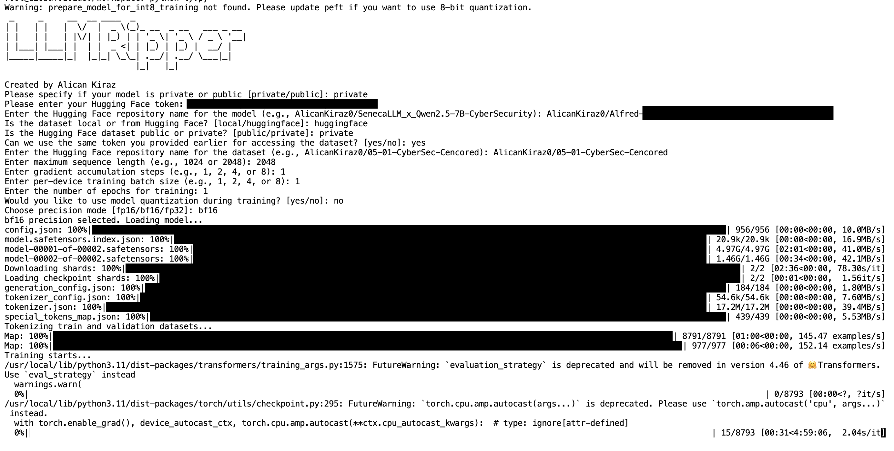

# LLMRipper


**LLMRipper** allows you to fine-tune any Hugging Face LLM model without writing any code, using the Transformers architecture.

With LLMRipper.py v1.0, you can perform fine-tuning on either a private or public LLM model and dataset using a single GPU. In the next version, support for multi-GPU training will also be added to the tool’s features.

## Features

- You can train **public** or **private** Hugging Face models.  
- You can provide a **CSV** or **JSON** dataset either locally or from Hugging Face.  
- You can set the **maximum batch size**, **gradient accumulation steps**, and **epoch** parameters you want for training.  
- You can **quantize** the model and train it using **4-bit** or **8-bit** QLoRA.  
- You can also train in **FP16**, **BF16**, or **FP32** precision without quantization.  
- By using **DDP**, you can define multiple GPUs for training (Note: This feature will be available in **v1.1**).  
- After training, you can **merge** the LoRA training outputs into the model and **push** it to Hugging Face.


## Demo




## Installation

1. **Clone the repository:**

   ```bash
   git clone https://github.com/YourUsername/LLMRipper.git
   cd LLMRipper

2. **Install Python Libraries:**

   ```bash
   pip install transformers datasets peft bitsandbytes


3. **Run the Code:**

   ```bash
   python LLMRipper.py

## Extras

**For training with RTX 5000 Series:**

   ```bash
   pip unistall torch torchvision torchaudio

   pip install --upgrade pip setuptools wheel

   pip install --pre torch --index-url https://download.pytorch.org/whl/nightly/cu128

   apt-get update && apt-get install -y build-essential cmake

